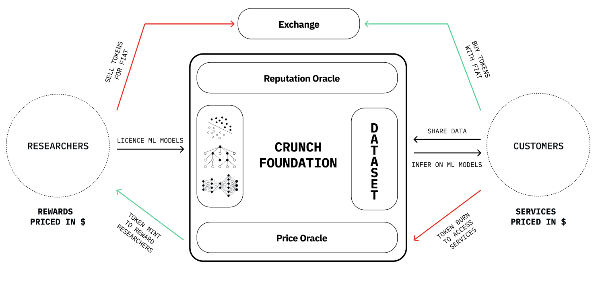

# Category

This is a core proposal.

# Overview

# Motivation

Align the interests of the entire Crunch ecosystem with the current market traction and expectations, setting the right framework for growth.

Note that this model is similar to Helium and Render Network’s Burn-and-Mint equilibrium model.

## Problems

1. Preference for Fiat Payments: Customers (i.e financial institutions) show a preference for fiat payments for services offered by the Foundation, affecting how we manage and integrate value within our ecosystem.

2. Rewards Selling Pressure: While Researchers are rewarded in $CRUNCH, their need for fiat introduces selling pressure on $CRUNCH when converted, impacting our ecosystem's stability.

3. Supply and Rewards Mechanisms: It's crucial for holders to have a clear understanding of the mechanisms governing $CRUNCH to ensure aligned expectations and foster a stable, informed and engaged community.

## Solutions

1. Services and Rewards need to be featured in FIAT rather than in $CRUNCH for a more transparent model. Customers will pay for our services by burning the token (or doing it via a proxy) and on the other end, Researchers will receive new minted tokens that they can fully or partially swap for FIAT.

2. In this context, the supply is driven by real world value capture which sets a more sustainable approach to the ecosystem’s buying and selling pressures.

3. Researchers can utilize, retain, or exchange their $CRUNCH tokens, with expanded functionalities in the near future.

# Stakeholders

This proposal impacts all members of the Render Network community

# Implementation

To be discussed

# Technical Considerations

To be discussed

# Technical Considerations

To be discussed